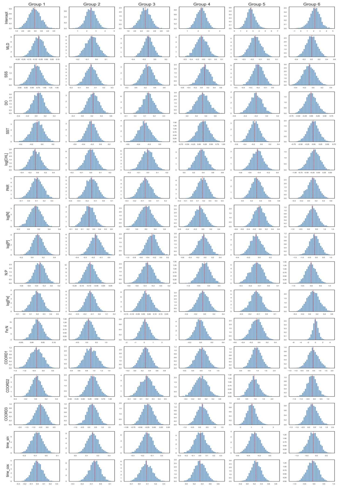

## 🌊📊 Bayesian and Data-Driven Modeling of Marine Nitrogen Fixation

Note: This repository contains the methodology, codebase structure, and selected visualizations for my Signature Work (First-authored manuscript in preparation). 
Full raw datasets are withheld pending publication, but sample data and fully reproducible pipelines are provided.

### 📌 Project Overview

This project tackles the challenge of predicting global marine Nitrogen (N₂) fixation rates under conditions of severe data sparsity, high measurement noise, and significant spatial heterogeneity.

By integrating multi-source satellite and in-situ datasets (SST, PAR, CHL, DO, etc.), we developed a depth-resolved (0-200m) prediction pipeline. 

We contrasted traditional machine learning models (Linear Regression, Random Forest) with a Bayesian Hierarchical Linear Regression (BHLR) model and a TabPFN-based framework, improving predictive performance from baseline models (e.g., Random Forest, $R^2 \approx 0.3$) to advanced approaches such as TabPFN ($R^2 \approx 0.7$ on held-out test data).

### 🧬 Methodological Transferability

These methodological parallels highlight the direct applicability of this work to:

- Multi-center clinical trial modeling (hierarchical effects)
- Rare disease prediction under limited samples (TabPFN)
- Risk prediction with uncertainty quantification (posterior inference)

### 🛠️ Repository Architecture
src/models/: Contains the core algorithmic implementations.

bayesian_hlr.py: PyMC implementation incorporating group-level intercepts/slopes.

tabpfn_model.py: Zero-shot prior-data fitted network inference for small-sample robustness.

src/data_processing.py: Trapezoidal integration scripts for 0-200m depth-resolved data.

notebooks/: Interactive visualizations of spatial mapping and model diagnostics.

### 📁 Results Directory

The `results/` folder contains all generated figures and tables:

- `Model_Comparison_4_Models.png` — Model performance comparison
- `Spatial_Distribution_Depth_vs_Surface.png` — Surface vs depth-resolved predictions
- `depth_profile_density.jpg` — Vertical distribution patterns
- `posterior_distributions.png` — Bayesian posterior uncertainty
- `depth_maps_*.png` — Model-specific spatial predictions
- `model_performance_metrics.csv` — Quantitative evaluation (R², RMSE, MAE)
- `depth_resolved_flux_table.csv` — Depth-integrated flux estimates
- `surface_model_flux_table.csv` — Surface-only flux estimates

### 📊 Key Results

#### 1. Model Performance Comparison


Figure 1. Comparison of predictive performance across four models (LR, RF, BHLR, TabPFN). TabPFN achieves the highest accuracy under sparse data conditions.

---

#### 2. Spatial Distribution of N₂ Fixation


Figure 2. Comparison between surface-only and depth-resolved predictions, highlighting substantial differences in spatial patterns and total flux estimation.

---

#### 3. Depth-Resolved Structure


Figure 3. Depth-resolved (0-80 m) global annual N2 fixation predicted by TabPFN. Figures are shown on a logarithmic scale. 


---

#### 4. Uncertainty Quantification (Bayesian Model)



Figure 4. Posterior distributions of model parameters across six biological groups.


  
### 🚀 Getting Started
To explore the model architectures using the provided sample data:
```bash
git clone https://github.com/PandaSun-43/Bayesian-ML-for-Depth-Resolved-N2-Fixation.git
cd Bayesian-ML-for-Depth-Resolved-N2-Fixation
pip install -r requirements.txt

Run the evaluation pipeline on sample data
python src/evaluation.py
```
```
