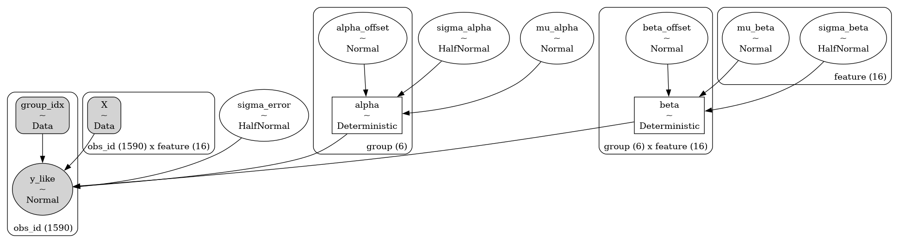
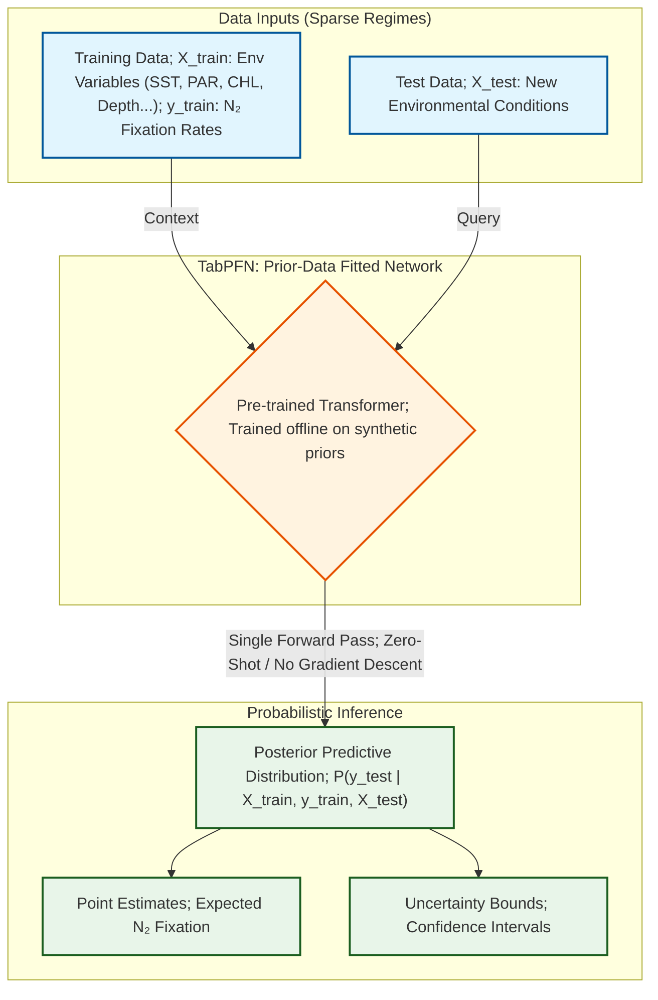
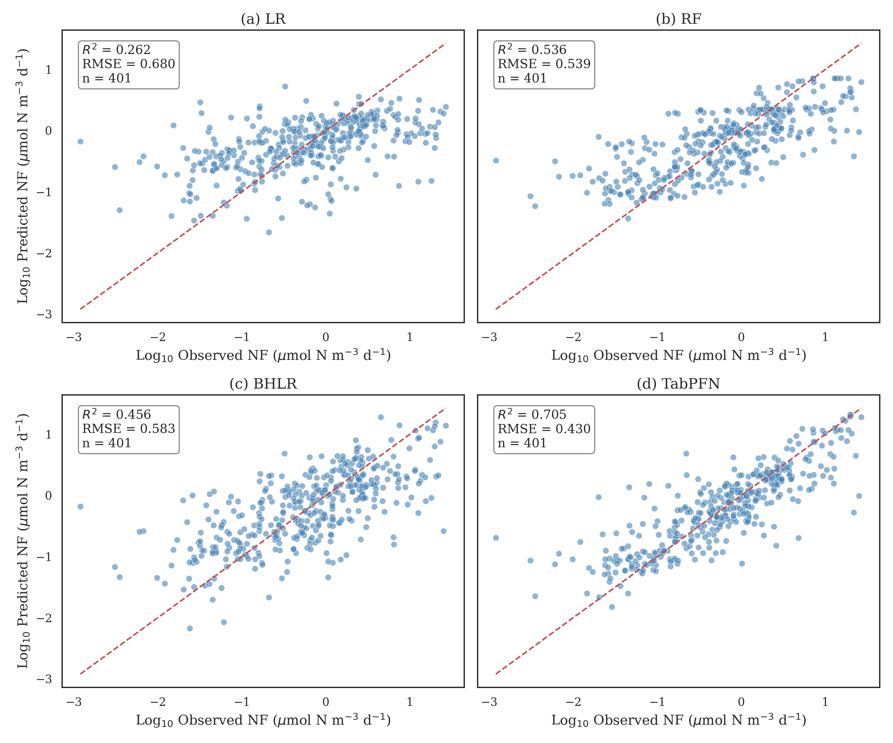
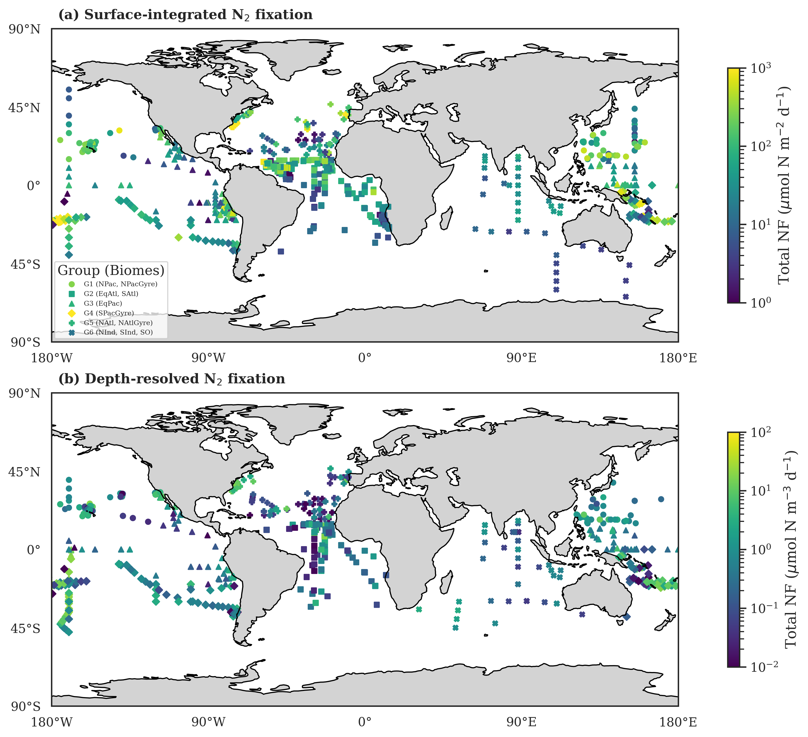
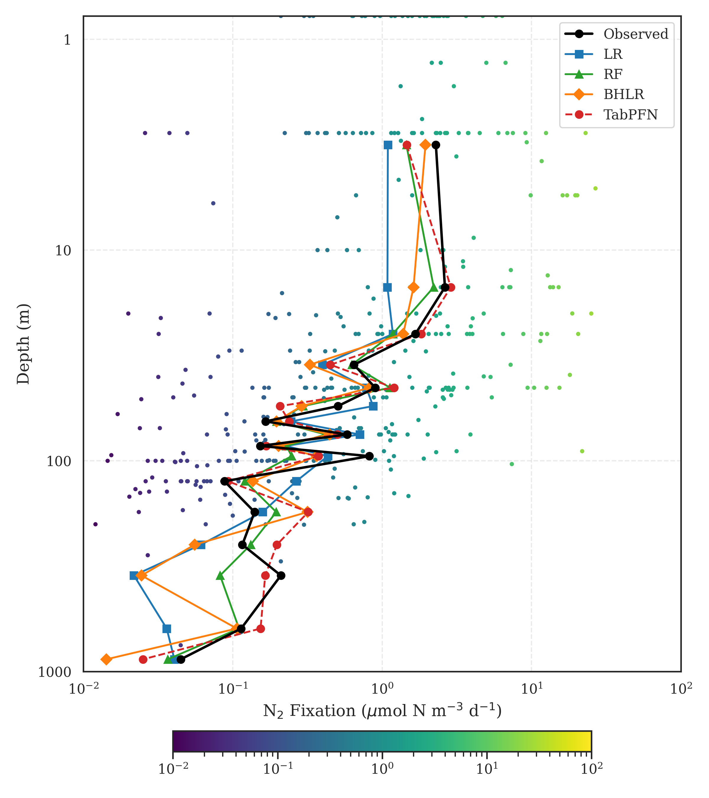
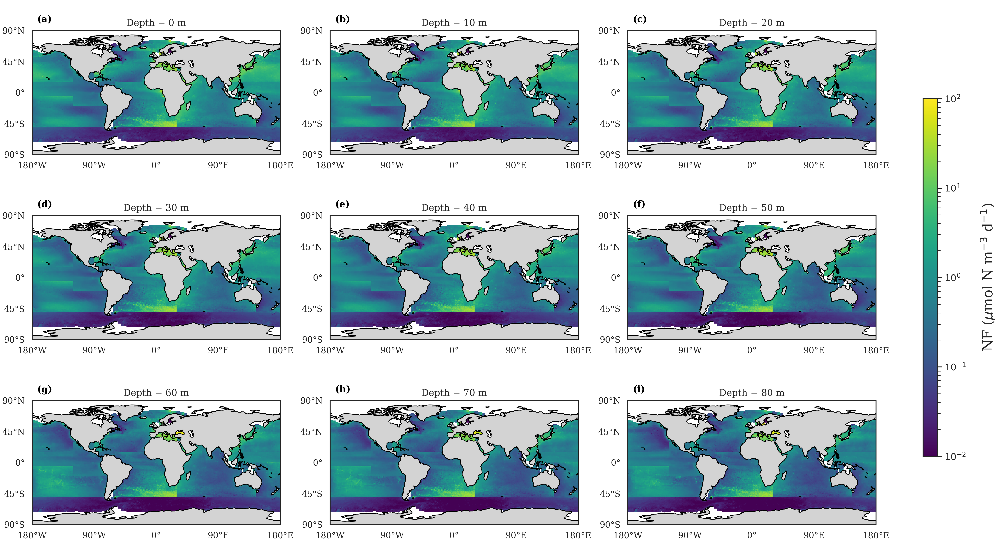
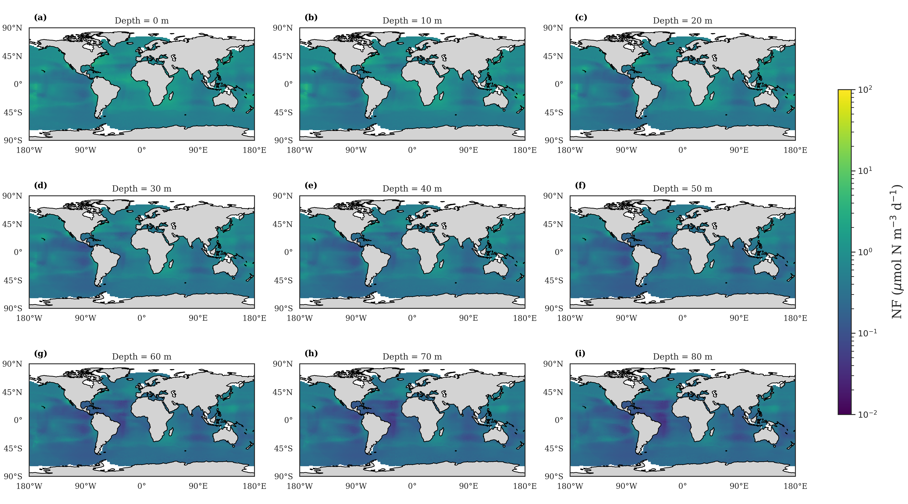

## 🌊📊 Bayesian and Data-Driven Modeling of Marine Nitrogen Fixation

Note: This repository contains the methodology, codebase structure, and selected visualizations for my Signature Work (part of the manuscript in preparation). 

Full raw datasets are withheld pending publication, but sample data and fully reproducible pipelines are provided.

### 📌 Project Overview

This project tackles the challenge of predicting global marine Nitrogen (N₂) fixation rates under conditions of severe data sparsity, high measurement noise, and significant spatial heterogeneity.

By integrating multi-source satellite and in-situ datasets (SST, PAR, CHL, DO, etc.), we developed a depth-resolved (0-200m) prediction pipeline. 

We contrasted traditional machine learning models (Linear Regression, Random Forest) with a Bayesian Hierarchical Linear Regression (BHLR) model and a TabPFN-based framework, improving predictive performance from baseline models (e.g., Random Forest, $R^2 \approx 0.3$) to advanced approaches such as TabPFN ($R^2 \approx 0.7$ on held-out test data).

### Bayesian Hierarchical Model
To properly model the complex spatiotemporal dynamics and address the severe data sparsity in certain oceanic regions, a **Bayesian Hierarchical Linear Regression (BHLR)** was implemented using PyMC. 


*Figure 1: Directed Acyclic Graph (DAG) of the BHLR model. The hierarchical structure allows information borrowing across different oceanic biomes, enhancing predictive stability in data-scarce regions.*

#### Model Architecture & Statistical Robustness
The model predicts the natural log of N₂ fixation ($\log y$) based on 16 environmental and spatiotemporal features ($X$). Key statistical designs include:

1. **Biome-Level Hierarchy (Analogous to Patient Sub-populations):** 
   Instead of fitting a single global model (ignoring regional heterogeneity) or completely separate models for each biome (prone to overfitting in sparse regions), we structured intercepts ($\alpha$) and slopes ($\beta$) hierarchically.

   This structure allows "partial pooling" of information. In Biostatistics, this is mathematically identical to adjusting for **multi-center clinical trials** or modeling diverse **patient demographic cohorts**, where baseline risks and treatment effects vary by group.
   
2. **Non-Centered Parameterization for MCMC Efficiency:**
   To overcome the classic funnel geometry problem in hierarchical Bayesian sampling, we employed a **non-centered parameterization**. Group-level parameters were modeled deterministically via standard normal offsets (e.g., $\alpha_{g} = \mu_\alpha + \alpha_{offset, g} \cdot \sigma_\alpha$). This ensured stable Hamiltonian Monte Carlo (HMC) sampling, yielding zero divergences and high effective sample sizes (ESS), guaranteeing the reliability of our posterior distributions.

3. **Interpretable Uncertainty:**
   Unlike point-estimate outputs from traditional ML baselines, our model produces full **posterior predictive distributions**. This strict quantification of uncertainty is crucial for assessing model confidence.


### Zero-Shot Probabilistic Inference via TabPFN
While our Bayesian Hierarchical model elegantly handled spatial heterogeneity, the fundamental challenge of extreme data sparsity remained in certain deep-ocean strata. 

To address this, we integrated TabPFN (Prior-Data Fitted Network), a cutting-edge foundation model for tabular data. More information can be found here: https://github.com/PriorLabs/TabPFN?tab=readme-ov-file.


*Figure 2: Flowchart of TabPFN Application to Marine Data.*

#### Why TabPFN? (Justification & Transferability)

- Robustness in Small-Sample Regimes: Marine in-situ observations are historically sparse ($N < 1,000$). Traditional Deep Learning severely overfits here. TabPFN, acting as an approximate Bayesian predictor, natively excels in these low-data environments, pushing our predictive $R^2$ to 0.71 (a ~20% improvement over Random Forest).

- In-Context Learning (Zero-Shot): By eliminating the need for hyperparameter optimization and cross-validation loops, TabPFN avoids data leakage and overfitting on small training sets. This is vital when building models on limited patient registries where preserving data for validation is crucial.


### 🧬 Methodological Transferability

These methodological parallels highlight the direct applicability of this work to:

- Multi-center clinical trial modeling (hierarchical effects)
- Rare disease prediction under limited samples (TabPFN)
- Risk prediction with uncertainty quantification (posterior inference)

### 🛠️ Repository Architecture
src/models/: Contains the core algorithmic implementations.

bayesian_hlr.py: PyMC implementation incorporating group-level intercepts/slopes.

tabpfn_model.py: Zero-shot prior-data fitted network inference for small-sample robustness.

src/data_processing.py: Trapezoidal integration scripts for 0-200m depth-resolved data.

notebooks/: Interactive visualizations of spatial mapping and model diagnostics.

### 📁 Results Directory

The `results/` folder contains all generated figures and tables:

- `Model_Comparison_4_Models.png` — Model performance comparison
- `Spatial_Distribution_Depth_vs_Surface.png` — Surface vs depth-resolved predictions
- `depth_profile_density.jpg` — Vertical distribution patterns
- `posterior_distributions.png` — Bayesian posterior uncertainty
- `depth_maps_*.png` — Model-specific spatial predictions
- `model_performance_metrics.csv` — Quantitative evaluation (R², RMSE, MAE)
- `depth_resolved_flux_table.csv` — Depth-integrated flux estimates
- `surface_model_flux_table.csv` — Surface-only flux estimates

### 📊 Key Results

#### 1. Model Performance Comparison



*Figure 3: Comparison of predictive performance across four models (LR, RF, BHLR, TabPFN). TabPFN achieves the highest accuracy under sparse data conditions.*

---

#### 2. Spatial Distribution of N₂ Fixation



*Figure 4: Comparison between surface-only and depth-resolved predictions, highlighting substantial differences in spatial patterns and total flux estimation.*

---

#### 3. Depth-Resolved Structure Across Models

A critical limitation of previous studies was the reliance on surface-only models, completely ignoring the complex vertical distribution of biological activity. We evaluated four distinct model architectures to reconstruct the continuous depth profiles of N₂ fixation from the surface down to 1000 meters. 

For Depth-resolved global annual N2 fixation prediction, due to the limitation of different variables, now we successfully developed it across 0-80m (v.1.0) and are extending it to 0-200m.


*Figure 5: Predicted vs. Observed vertical depth profiles (0-1000m) across four model architectures. The x-axis represents the N₂ fixation rate, and the y-axis represents depth.*



*Figure 6: Depth-resolved (0-80 m, v.1.0) global annual N2 fixation predicted by BHLR. Figures are shown on a logarithmic scale.*



*Figure 7: Depth-resolved (0-80 m, v.1.0) global annual N2 fixation predicted by TabPFN. Figures are shown on a logarithmic scale.*


### 🔭 Ongoing Work

- Extending depth-resolved analysis from surface layers to full 0–200 m water column with improved visualization and integration schemes  
- Adapting TabPFN to spatiotemporal structured inputs for enhanced representation learning  
- Preparing the manuscript for journal submission


### 🚀 Getting Started
To explore the model architectures using the provided sample data:
```bash
git clone https://github.com/PandaSun-43/Bayesian-ML-for-Depth-Resolved-N2-Fixation.git
cd Bayesian-ML-for-Depth-Resolved-N2-Fixation
pip install -r requirements.txt

Run the evaluation pipeline on sample data
python src/evaluation.py
```
```
